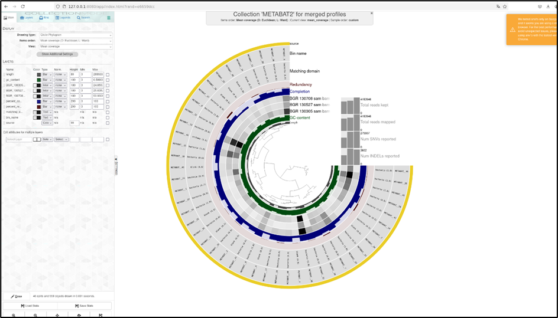
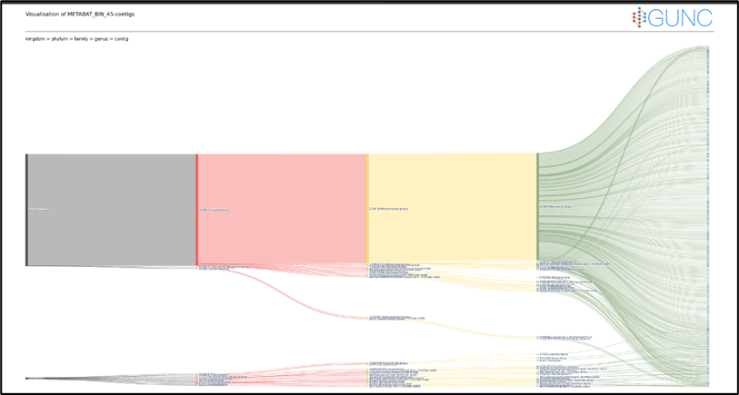
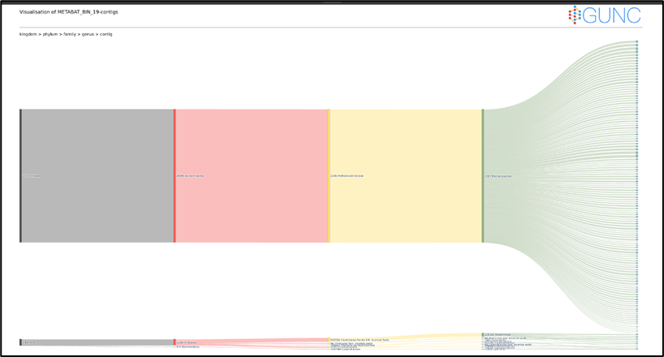
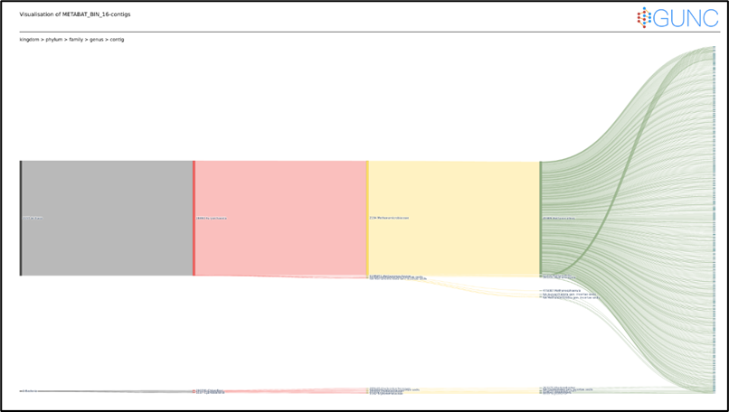
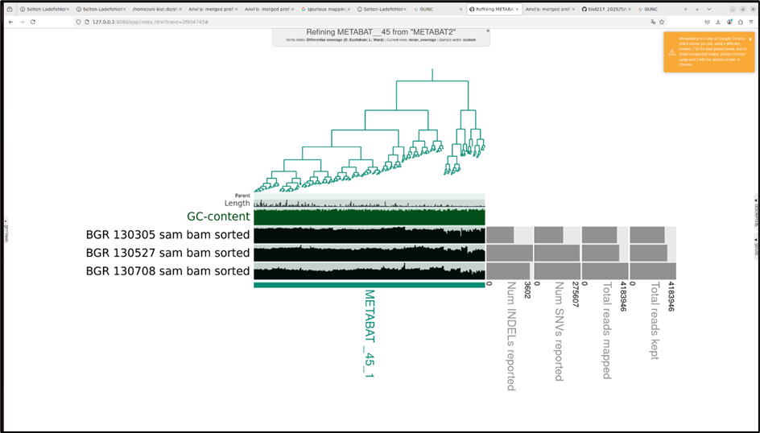

# DAY2 : Metagenomics
## What is it - study of whole microbial community directly from the environment it is living in
- No culture

### AIM 
> To construct MAGS from raw reads

STEPS
> 1) Quality Control
> 2) Assembly 
> 3) Binning
> 4) Bin Refinement
> 5) Taxonomy Assignment

Whole Code
```
# fastqc command
#!/bin/bash
#SBATCH --job-name=fastqc
#SBATCH --output=fastqc.out
#SBATCH --error=fastqc.err
#SBATCH --nodes=1
#SBATCH --ntasks-per-node=1
#SBATCH --cpus-per-task=12
#SBATCH --mem=25G
#SBATCH --partition=base
#SBATCH --time=5:00:00
#SBATCH --reservation=biol217

#load necessary modules
module purge
module load gcc12-env/12.1.0
module load micromamba/1.4.2
eval "$(micromamba shell hook --shell=bash)"
export MAMBA_ROOT_PREFIX=$WORK/.micromamba

cd $WORK

micromamba activate 00_anvio

for file in /work_beegfs/sunam232/metagenomics/0_raw_reads/*.gz
do 
    fastqc $file -o /work_beegfs/sunam232/metagenomics/0_raw_reads/fastqc_output
done

# ##----------------- End -------------
module purge
jobinfo


#fastp command
#!/bin/bash
#SBATCH --job-name=fastp
#SBATCH --output=fastp.out
#SBATCH --error=fastp.err
#SBATCH --nodes=1
#SBATCH --ntasks-per-node=1
#SBATCH --cpus-per-task=12
#SBATCH --mem=25G
#SBATCH --partition=base
#SBATCH --time=5:00:00
#SBATCH --reservation=biol217


#load necessary modules
module load gcc12-env/12.1.0
module load micromamba
eval "$(micromamba shell hook --shell=bash)"
export MAMBA_ROOT_PREFIX=$WORK/.micromamba

cd $WORK

micromamba activate .micromamba/envs/00_anvio/

fastp -i /work_beegfs/sunam232/metagenomics/0_raw_reads/BGR_130305_mapped_R1.fastq.gz -I /work_beegfs/sunam232/metagenomics/0_raw_reads/BGR_130305_mapped_R2.fastq.gz -R /work_beegfs/sunam232/metagenomics/0_raw_reads/report/fastp305_report -o /work_beegfs/sunam232/metagenomics/0_raw_reads/clean/BGR_130305_cleaned_R1.fastq.gz -O /work_beegfs/sunam232/metagenomics/0_raw_reads/clean/BGR_130305_cleaned_R2.fastq.gz -t 6 -q 20
fastp -i /work_beegfs/sunam232/metagenomics/0_raw_reads/BGR_130527_mapped_R1.fastq.gz -I /work_beegfs/sunam232/metagenomics/0_raw_reads/BGR_130527_mapped_R2.fastq.gz -R /work_beegfs/sunam232/metagenomics/0_raw_reads/report/fastp527_report -o /work_beegfs/sunam232/metagenomics/0_raw_reads/clean/BGR_130527_cleaned_R1.fastq.gz -O /work_beegfs/sunam232/metagenomics/0_raw_reads/clean/BGR_130527_cleaned_R2.fastq.gz -t 6 -q 20
fastp -i /work_beegfs/sunam232/metagenomics/0_raw_reads/BGR_130708_mapped_R1.fastq.gz -I /work_beegfs/sunam232/metagenomics/0_raw_reads/BGR_130708_mapped_R2.fastq.gz -R /work_beegfs/sunam232/metagenomics/0_raw_reads/report/fastp708_report -o /work_beegfs/sunam232/metagenomics/0_raw_reads/clean/BGR_130708_cleaned_R1.fastq.gz -O /work_beegfs/sunam232/metagenomics/0_raw_reads/clean/BGR_130708_cleaned_R2.fastq.gz -t 6 -q 20

# ##----------------- End -------------
module purge


#assembly output

#!/bin/bash
#SBATCH --job-name=assembly
#SBATCH --output=assembly.out
#SBATCH --error=assembly.err
#SBATCH --nodes=1
#SBATCH --ntasks-per-node=1
#SBATCH --cpus-per-task=12
#SBATCH --mem=25G
#SBATCH --partition=base
#SBATCH --time=5:00:00
#SBATCH --reservation=biol217


#load necessary modules
module load gcc12-env/12.1.0
module load micromamba
eval "$(micromamba shell hook --shell=bash)"
export MAMBA_ROOT_PREFIX=$WORK/.micromamba

cd $WORK

micromamba activate .micromamba/envs/00_anvio/

cd /work_beegfs/sunam232/metagenomics/0_raw_reads/clean

megahit -1 BGR_130305_cleaned_R1.fastq.gz -1 BGR_130527_cleaned_R1.fastq.gz -1 BGR_130708_cleaned_R1.fastq.gz -2 BGR_130305_cleaned_R2.fastq.gz -2 BGR_130527_cleaned_R2.fastq.gz -2 BGR_130708_cleaned_R2.fastq.gz --min-contig-len 1000 --presets meta-large -m 0.85 -o /work_beegfs/sunam232/metagenomics/0_raw_reads/assembly_output -t 12 

# ##----------------- End -------------
module purge
jobinfo

## assembly evalution
metaquast -t 6 -o /work_beegfs/sunam232/metagenomics/0_raw_reads/assembly_output/3_metaquast -m 1000 final.contigs.fa
```

```
### Bining

anvi-script-reformat-fasta final.contigs.fa -o /work_beegfs/sunam232/metagenomics/0_raw_reads/binning_output/contigs.anvio.fa --min-len 1000 --simplify-names --report-file name_conversion.txt


## Mapping
bowtie2-build contigs.anvio.fa contigs.anvio.fa.index

cd /work_beegfs/sunam232/metagenomics/0_raw_reads/clean

for i in *_R1_clean.fastq.gz; do
  base="${i%_R1_clean.fastq.gz}"; bowtie2 --very-fast -x /work_beegfs/sunam232/metagenomics/0_raw_reads/binning_output/contigs.anvio.fa.index -1 $i -2 "$base"_R2_clean.fastq.gz -S /work_beegfs/sunam232/metagenomics/0_raw_reads/binning_output/4_mapping/"${base}".sam 


 samtools view -bS sam_file.sam > bam_file.bam


## Contigs data prep

anvi-gen-contigs-database -f contigs.anvio.fa -o contigs.db -n 'biol217'

## HMMs
anvi-run-hmms -c contigs.db
```
### Here we first time did visualization with anvio

## Bining was carried out by anvio using both METABAT2 and MAXBIN
 - Sorting and Indexing bam files
 - creating anvi merged profiles
 - Bining with MAXBIN2
 - Bining with METABAT2
 

## Chimera was detected using GUNC tool

 METABAT45 GUNC OUTPUT

 
 METABAT19 GUNC OUTPUT

 
 METABAT16 GUNC OUTPUT

 Only 3 archaeal bins were obatained from METABAT, only 1 was high quality archaeal bin METABAT_45 with 98.68% completness

 METABAT_19 bin is a archaeal chimeric bin as it has CSS score of 1 for all the taxonomic level, whereas METABAT_16  bin becomes chimeric at species level.

 ## Manual Refinement
 

 ## Taxonomic Assignement to bins
 >METABAT_45 -  Methanoculleus sp012797575

 >METABAT_16 - Methanosarcina flavescens

 >METABAT_19 - Methanoculleus Thermohydrogenotrophicum

 All these bins contains methanogens.


