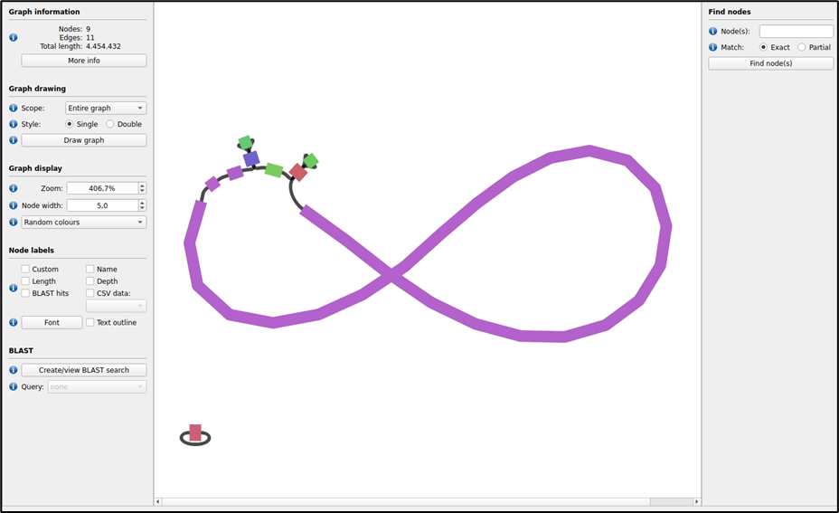

# DAY6_Protocol : Genomics

AIM 
> To do Hybrid assembly of pair-end reads

> Combining power of single reads and long reads

### Quality control for Short Reads
```
#!/bin/bash
#SBATCH --nodes=1
#SBATCH --cpus-per-task=16
#SBATCH --mem=32G
#SBATCH --time=5:00:00
#SBATCH --job-name=01_fastqc
#SBATCH --output=01_fastqc.out
#SBATCH --error=01_fastqc.err
#SBATCH --partition=base
#SBATCH --reservation=biol217

module load gcc12-env/12.1.0
module load micromamba/1.4.2
eval "$(micromamba shell hook --shell=bash)"
cd $WORK
micromamba activate .micromamba/envs/01_short_reads_qc


# a new folder for output of qc 

mkdir -p $WORK/genomics/1_short_reads_qc/1_fastqc_raw
for i in $WORK/genomics/0_raw_reads/short_reads/*.gz; 
do fastqc $i -o ./add/absolute/path/output_dir/ -t 16; 
done


## 1.1 fastqc raw reads
mkdir -p $WORK/genomics/1_short_reads_qc/1_fastqc_raw
for i in *.gz; do fastqc $i -o $WORK/genomics/1_short_reads_qc/1_fastqc_raw -t 16; done


## 1.2 fastp 
mkdir -p $WORK/genomics/1_short_reads_qc/2_cleaned_reads
fastp -i $WORK/genomics/0_raw_reads/short_reads/241155E_R1.fastq.gz \
 -I $WORK/genomics/0_raw_reads/short_reads/241155E_R2.fastq.gz \
 -R $WORK/genomics/1_short_reads_qc/2_cleaned_reads/fastp_report \
 -h $WORK/genomics/1_short_reads_qc/2_cleaned_reads/report.html \
 -o $WORK/genomics/1_short_reads_qc/2_cleaned_reads/241155E_R1_clean.fastq.gz --trim_front1 20 -q 25 \
 -O $WORK/genomics/1_short_reads_qc/2_cleaned_reads/241155E_R2_clean.fastq.gz --trim_front2 20 -q 25 


## 1.3 fastqc cleaned
mkdir -p $WORK/genomics/1_short_reads_qc/3_fastqc_cleaned
for i in $WORK/genomics/1_short_reads_qc/2_cleaned_reads/*.gz; do 
fastqc $i -o $WORK/genomics/1_short_reads_qc/3_fastqc_cleaned -t 16; 
done

micromamba deactivate
echo "---------short read cleaning completed successfully---------"


```


### Quality Control for Long Reads

```
#!/bin/bash
#SBATCH --nodes=1
#SBATCH --cpus-per-task=16
#SBATCH --mem=32G
#SBATCH --time=5:00:00
#SBATCH --job-name=01_fastqc
#SBATCH --output=01_fastqc.out
#SBATCH --error=01_fastqc.err
#SBATCH --partition=base
#SBATCH --reservation=biol217

module load gcc12-env/12.1.0
module load miniconda3/4.12.0
module load micromamba/1.4.2
eval "$(micromamba shell hook --shell=bash)"
cd $WORK
micromamba activate .micromamba/envs/02_long_reads_qc


# 2.1 Nanoplot
cd $WORK/genomics/0_raw_reads/long_reads/
NanoPlot --fastq $file -o $output_dir -t 6 --maxlength 40000 --minlength 1000 --plots kde --format png --N50 --dpi 300 --store --raw --tsv_stats --info_in_report

# 2.2 Filtlong
filtlong --min_length 1000 --keep_percent 90 $file1 | gzip > sample1_cleaned_filtlong.fastq.gz
mv sample1_cleaned_filtlong.fastq.gz $output_dir

# 2.3 Nanoplot again
NanoPlot --fastq $input_dir/file1_cleaned_filtlong.fastq.gz -o $output_dir -t 6 --maxlength 40000 --minlength 1000 --plots kde --format png --N50 --dpi 300 --store --raw --tsv_stats --info_in_report

micromamba deactivate
echo "---------long read cleaning completed successfully---------"
```

### Assembly Using Unicycler
```
# 3 Assembly (1 hour)-----------------------------------------------------------
echo "---------Unicycler Assembly pipeline started---------"
eval "$(micromamba shell hook --shell=bash)"
cd $WORK
micromamba activate .micromamba/envs/03_unicycler
cd $WORK/genomics
mkdir -p $WORK/genomics/3_hybrid_assembly
unicycler -1 $WORK/genomics/1_short_reads_qc/2_cleaned_reads/241155E_R1_clean.fastq.gz -2 $WORK/genomics/1_short_reads_qc/2_cleaned_reads/241155E_R2_clean.fastq.gz -l $WORK/genomics/2_long_reads_qc/2_cleaned_reads/241155E_cleaned_filtlong.fastq.gz -o $WORK/genomics/3_hybrid_assembly/ -t 32
micromamba deactivate
echo "---------Unicycler Assembly pipeline Completed Successfully---------"
```
### Quality check of assembly
```
# 4 Assembly quality-----------------------------------------------------------
echo "---------Assembly Quality Check Started---------"

## 4.1 Quast (5 minutes)
micromamba activate .micromamba/envs/04_quast
cd $WORK/genomics/3_hybrid_assembly
mkdir -p $WORK/genomics/3_hybrid_assembly/quast
quast.py $WORK/genomics/3_hybrid_assembly/assembly.fasta --circos -L --conserved-genes-finding --rna-finding \
 --glimmer --use-all-alignments --report-all-metrics -o $WORK/genomics/3_hybrid_assembly/quast -t 32
micromamba deactivate

## 4.2 CheckM
micromamba activate .micromamba/envs/04_checkm
checkm data setRoot $WORK/databases/checkm # Attach the database
cd $WORK/genomics/3_hybrid_assembly
mkdir -p $WORK/genomics/3_hybrid_assembly/checkm
checkm lineage_wf $WORK/genomics/3_hybrid_assembly/ $WORK/genomics/3_hybrid_assembly/checkm -x fasta --tab_table --file $WORK/genomics/3_hybrid_assembly/checkm/checkm_results -r -t 32
checkm tree_qa $WORK/genomics/3_hybrid_assembly/checkm
checkm qa $WORK/genomics/3_hybrid_assembly/checkm/lineage.ms $WORK/genomics/3_hybrid_assembly/checkm/ -o 1 > $WORK/genomics/3_hybrid_assembly/checkm/Final_table_01.csv
checkm qa $WORK/genomics/3_hybrid_assembly/checkm/lineage.ms $WORK/genomics/3_hybrid_assembly/checkm/ -o 2 > $WORK/genomics/3_hybrid_assembly/checkm/final_table_checkm.csv
micromamba deactivate

# 4.3 Checkm2

cd $WORK
micromamba activate .micromamba/envs/04_checkm2
cd $WORK/genomics/3_hybrid_assembly
mkdir -p $WORK/genomics/3_hybrid_assembly/checkm2
checkm2 predict --threads 2 --input $WORK/genomics/3_hybrid_assembly/*.fasta --output-directory $WORK/genomics/3_hybrid_assembly/checkm2 
micromamba deactivate
echo "---------Assembly Quality Check Completed Successfully---------"


# 4.4 Visualization of Assembly Using Bandage


# 5 Annotate
echo "---------Prokka Genome Annotation Started---------"

cd $WORK
micromamba activate .micromamba/envs/05_prokka
cd $WORK/genomics/3_hybrid_assembly
# Prokka creates the output dir on its own
prokka $WORK/genomics/3_hybrid_assembly/assembly.fasta --outdir $WORK/genomics/4_annotated_genome --kingdom Bacteria --addgenes --cpus 32
micromamba deactivate
echo "---------Prokka Genome Annotation Completed Successfully---------"

# 6 Classification-----------------------------------------------------------
#!/bin/bash
#SBATCH --nodes=1
#SBATCH --cpus-per-task=16
#SBATCH --mem=96G
#SBATCH --time=1:00:00
#SBATCH --job-name=01_fastqc
#SBATCH --output=01_fastqc.out
#SBATCH --error=01_fastqc.err
#SBATCH --partition=base
#SBATCH --reservation=biol217

echo "---------GTDB Classification Started---------"
# (can not work, maybe due to insufficient memory usage increase the ram in bash script)
cd $WORK
micromamba activate .micromamba/envs/06_gtdbtk
conda env config vars set GTDBTK_DATA_PATH="$WORK/databases/gtdbtk/release220";
cd $WORK/genomics/4_annotated_genome
mkdir -p $WORK/genomics/5_gtdb_classification
echo "---------GTDB Classification will run now---------"
gtdbtk classify_wf --cpus 12 --genome_dir $WORK/genomics/4_annotated_genome/ --out_dir $WORK/genomics/5_gtdb_classification --extension .fna --skip_ani_screen
# reduce cpu and increase the ram in bash script in order to have best performance
micromamba deactivate
echo "---------GTDB Classification Completed Successfully---------"

#7 MultiQC Report

#!/bin/bash
#SBATCH --nodes=1
#SBATCH --cpus-per-task=16
#SBATCH --mem=96G
#SBATCH --time=1:00:00
#SBATCH --job-name=01_fastqc
#SBATCH --output=01_fastqc.out
#SBATCH --error=01_fastqc.err
#SBATCH --partition=base
#SBATCH --reservation=biol217
cd #WORK
micromamba activate .micromamba/envs/01_short_reads_qc
multiqc -d $WORK/genomics/ -o $WORK/genomics/6_multiqc
micromamba deactivate
echo"------multiqc report generated--------"
```


Genome assembly using Hybrid Assembler.
> an genome assembly consists of :

> larger contig length 4.5 Mbp  

> smaller contig of 9126 bp. 

> completeness of 99.98 %   contamination of 0.29 %. 

> Value of N50 – 4332314 bp