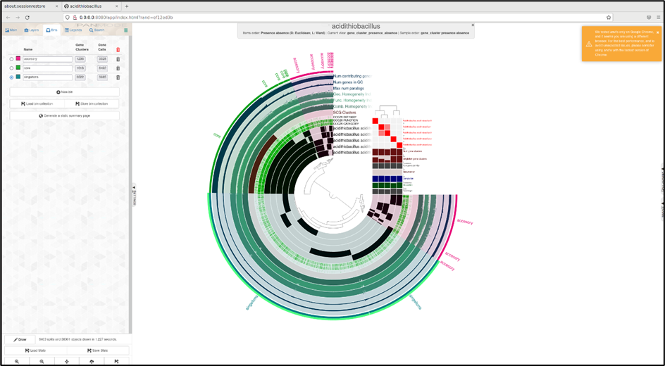

# DAY7_Protocol : Pangenomics

AIM : To create pangenome from the data provided and create a pangenome of any orgnanisms.

Thus, 2 pangenomes were created 
1) V. jasicida
2) Acidithiobacillus

# Script for V. jascida Pangenome
```
#!/bin/bash
#SBATCH --nodes=1
#SBATCH --cpus-per-task=16
#SBATCH --mem=32G
#SBATCH --time=2:00:00
#SBATCH --job-name=anvio_pangenomics
#SBATCH --output=anvio_pangenomics.out
#SBATCH --error=anvio_pangenomics.err
#SBATCH --partition=base
#SBATCH --reservation=biol217


module load gcc12-env/12.1.0
module load micromamba/1.4.2
eval "$(micromamba shell hook --shell=bash)"
cd $WORK
micromamba activate .micromamba/envs/00_anvio/


# create new folder
mkdir $WORK/pangenomics/01_anvio_pangenomics

# download the data
curl -L https://ndownloader.figshare.com/files/28965090 -o V_jascida_genomes.tar.gz
tar -zxvf V_jascida_genomes.tar.gz
ls V_jascida_genomes

# create contig.db from .fasta
cd $WORK/pangenomics_test/V_jascida_genomes/

ls *fasta | awk 'BEGIN{FS="_"}{print $1}' > genomes.txt

#!/bin/bash
#SBATCH --nodes=1
#SBATCH --cpus-per-task=16
#SBATCH --mem=32G
#SBATCH --time=2:00:00
#SBATCH --job-name=anvio_pangenomics
#SBATCH --output=anvio_pangenomics.out
#SBATCH --error=anvio_pangenomics.err
#SBATCH --partition=base
#SBATCH --reservation=biol217

module load gcc12-env/12.1.0
module load micromamba/1.4.2
eval "$(micromamba shell hook --shell=bash)"
cd $WORK
micromamba activate .micromamba/envs/00_anvio/

cd ./path/to/your/genomes
# remove all contigs <2500 nt
for g in `cat genomes.txt`
do
    echo
    echo "Working on $g ..."
    echo
    anvi-script-reformat-fasta ${g}_scaffolds.fasta \
                               --min-len 2500 \
                               --simplify-names \
                               -o ${g}_scaffolds_2.5K.fasta
done

# generate contigs.db
for g in `cat genomes.txt`
do
    echo
    echo "Working on $g ..."
    echo
    anvi-gen-contigs-database -f ${g}_scaffolds_2.5K.fasta \
                              -o V_jascida_${g}.db \
                              --num-threads 4 \
                              -n V_jascida_${g}
done

# annotate contigs.db
for g in *.db
do
    anvi-run-hmms -c $g --num-threads 4
    anvi-run-ncbi-cogs -c $g --num-threads 4
    anvi-scan-trnas -c $g --num-threads 4
    anvi-run-scg-taxonomy -c $g --num-threads 4
done
```
## visualize contig.db using anvio interactive 

## create external gennome
```
anvi-script-gen-genomes-file --input-dir /path/to/input/dir \
                             -o external-genomes.txt

```

## Compute pangenome
```
anvi-gen-genomes-storage -e external-genomes.txt \
                         -o V_jascida-GENOMES.db

anvi-pan-genome -g V_jascida-GENOMES.db \
                --project-name V_jascida \
                --num-threads 4                         
```

## Display the pangenome
```
srun --pty --mem=10G --nodes=1 --tasks-per-node=1 --cpus-per-task=1 --partition=base /bin/bash

module load gcc12-env/12.1.0
module load micromamba/1.4.2
eval "$(micromamba shell hook --shell=bash)"
cd $WORK
micromamba activate .micromamba/envs/00_anvio/

anvi-display-pan -p V_jascida/V_jascida-PAN.db \
                 -g V_jascida-GENOMES.db

 micromamba deactivate
echo "---------pangenome created successfully---------"
```


# Script for Acidithiobacillus
### Acidithiobacillus was choosen because it is significant in astrobiological studies

```
#!/bin/bash
#SBATCH --nodes=1
#SBATCH --cpus-per-task=16
#SBATCH --mem=32G
#SBATCH --time=2:00:00
#SBATCH --job-name=anvio_pangenomics
#SBATCH --output=anvio_pangenomics.out
#SBATCH --error=anvio_pangenomics.err
#SBATCH --partition=base
#SBATCH --reservation=biol217


module load gcc12-env/12.1.0
module load micromamba/1.4.2
eval "$(micromamba shell hook --shell=bash)"
cd $WORK
micromamba activate .micromamba/envs/00_anvio/

# go to your folder where you have all the genomes
cd /path/to/your/genomes

#1- rename files
for file in *.fna; do mv "$file" "${file%.fna}.fasta"; done

#2- Fast files to contigs DBs
#put genome into text file to make for loop
ls *fasta | awk 'BEGIN{FS="."}{print $1}' > genomes.txt
# reformat fasta files
for g in `cat genomes.txt`
do
    echo
    echo "Working on $g ..."
    echo
    anvi-script-reformat-fasta ${g}.fasta \
                               --min-len 2500 \
                               --simplify-names \
                               -o ${g}_2.5K.fasta
done


name="acidithiobacillus"

#convert into contigs dbs
for g in `cat genomes.txt`
do
    echo
    echo "Working on $g ..." 
    echo
    anvi-gen-contigs-database -f ${g}_2.5K.fasta \
                              -o ${name}_${g}.db \
                              --num-threads 12 \
                              -n ${name}_${g}
done


#3- annotating contigs db
for g in *.db
do
    anvi-run-hmms -c $g --num-threads 12
    anvi-run-ncbi-cogs -c $g --num-threads 12
    anvi-scan-trnas -c $g --num-threads 12
    anvi-run-scg-taxonomy -c $g --num-threads 12
done


#4- creating an external genome file
anvi-script-gen-genomes-file --input-dir . \
                             -o external-genomes.txt

#5- Estimating contamination
anvi-estimate-genome-completeness -e external-genomes.txt
# check if refinement needed or turn off this

#6- computing a pangenome
anvi-gen-genomes-storage -e external-genomes.txt \
                         -o ${name}-GENOMES.db

anvi-pan-genome -g ${name}-GENOMES.db \
                --project-name ${name} \
                --num-threads 12
############################################################################################################
# Display your pangenome directly here if you want to look into it
anvi-display-pan -p acidithiobacillus/acidithiobacillus-PAN.db \
                    -g acidithiobacilluss-GENOMES.db

############################################################################################################


#7- calculating average nucleotide identity ANI
anvi-compute-genome-similarity --external-genomes external-genomes.txt \
                               --program pyANI \
                               --output-dir ANI \
                               --num-threads 12 \
                               --pan-db ${name}/${name}-PAN.db 


#8- phylogenomic tree
anvi-get-sequences-for-gene-clusters -p ${name}/${name}-PAN.db \
                                     -g ${name}-GENOMES.db \
                                     --min-num-genomes-gene-cluster-occurs 5 \ 
                                     --max-num-genes-from-each-genome 1 \
                                     --concatenate-gene-clusters \
                                     --output-file ${name}/${name}-SCGs.fa

trimal -in ${name}/${name}-SCGs.fa \
         -out ${name}/${name}-SCGs-clean.fa \
         -gt 0.5

iqtree -s ${name}/${name}-SCGs-clean.fa \
       -m WAG \
       -bb 1000 \
       -nt $threads
       
       micromamba deactivate
echo "---------pangenome created successfully---------"
```
## RESULTS
For Acidithiobacillus


> More clusters of singeltons 

> High abundance of core genes