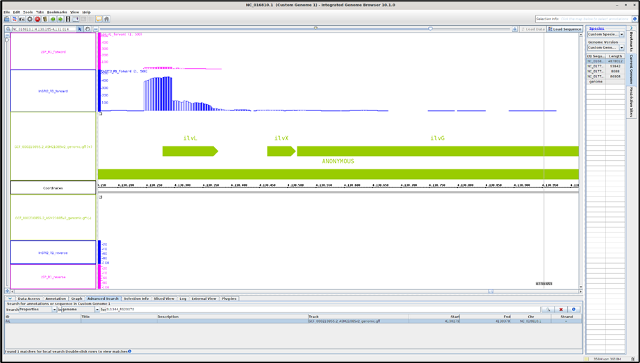
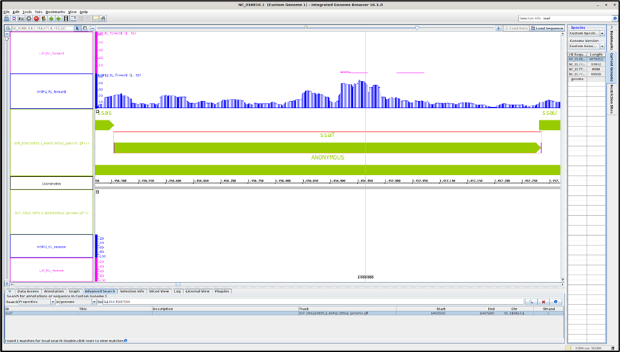
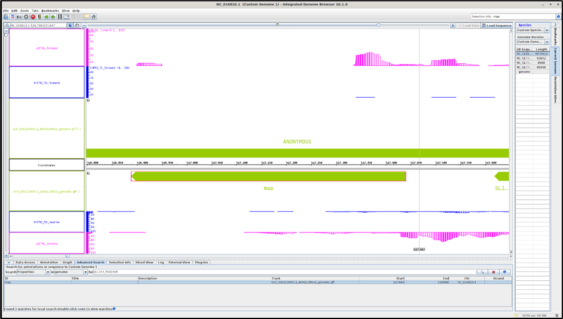

# DAY8_Protocol : Transcriptomics

Aim : To do RNA seq analysis and understand differential gene expression as well.

Here dataset from Kröger et al. 2013.

2 mediums
InSIP2 and LSP 
```
To see gene expression and log2Fold change
#!/bin/bash
#SBATCH --nodes=1
#SBATCH --cpus-per-task=16
#SBATCH --mem=32G
#SBATCH --time=2:00:00
#SBATCH --job-name=reademption
#SBATCH --output=reademption.out
#SBATCH --error=reademption.err
#SBATCH --partition=base
#SBATCH --reservation=biol217


module load gcc12-env/12.1.0
module load micromamba/1.4.2
eval "$(micromamba shell hook --shell=bash)"
micromamba activate $WORK/.micromamba/envs/08_reademption

#set proxy environment to download the data and use the internet in the backend
export http_proxy=http://relay:3128
export https_proxy=http://relay:3128
export ftp_proxy=http://relay:3128

# create folders
reademption create --project_path READemption_analysis --species salmonella="Salmonella Typhimurium"
```
# Download the files
```

FTP_SOURCE=ftp://ftp.ncbi.nih.gov/genomes/archive/old_refseq/Bacteria/Salmonella_enterica_serovar_Typhimurium_SL1344_uid86645/
wget -O READemption_analysis/input/salmonella_reference_sequences/NC_016810.fa $FTP_SOURCE/NC_016810.fna
wget -O READemption_analysis/input/salmonella_reference_sequences/NC_017718.fa $FTP_SOURCE/NC_017718.fna
wget -O READemption_analysis/input/salmonella_reference_sequences/NC_017719.fa $FTP_SOURCE/NC_017719.fna
wget -O READemption_analysis/input/salmonella_reference_sequences/NC_017720.fa $FTP_SOURCE/NC_017720.fna

#rename the files similar to the genome naming
sed -i "s/>/>NC_016810.1 /" READemption_analysis/input/salmonella_reference_sequences/NC_016810.fa
sed -i "s/>/>NC_017718.1 /" READemption_analysis/input/salmonella_reference_sequences/NC_017718.fa
sed -i "s/>/>NC_017719.1 /" READemption_analysis/input/salmonella_reference_sequences/NC_017719.fa
sed -i "s/>/>NC_017720.1 /" READemption_analysis/input/salmonella_reference_sequences/NC_017720.fa
wget -P READemption_analysis/input/salmonella_annotations https://ftp.ncbi.nlm.nih.gov/genomes/all/GCF/000/210/855/GCF_000210855.2_ASM21085v2/GCF_000210855.2_ASM21085v2_genomic.gff.gz
```


# unzip the file
```
gunzip READemption_analysis/input/salmonella_annotations/GCF_000210855.2_ASM21085v2_genomic.gff.gz
wget -P READemption_analysis/input/reads http://reademptiondata.imib-zinf.net/InSPI2_R1.fa.bz2
wget -P READemption_analysis/input/reads http://reademptiondata.imib-zinf.net/InSPI2_R2.fa.bz2
wget -P READemption_analysis/input/reads http://reademptiondata.imib-zinf.net/LSP_R1.fa.bz2
wget -P READemption_analysis/input/reads http://reademptiondata.imib-zinf.net/LSP_R2.fa.bz2

#read alignment
reademption align -p 4 --poly_a_clipping --project_path READemption_analysis
```

# read coverage
```
reademption coverage -p 4 --project_path READemption_analysis
```

# gene quantification
```
reademption gene_quanti -p 4 --features CDS,tRNA,rRNA --project_path READemption_analysis
reademption deseq -l InSPI2_R1.fa.bz2,InSPI2_R2.fa.bz2,LSP_R1.fa.bz2,LSP_R2.fa.bz2 -c InSPI2,InSPI2,LSP,LSP -r 1,2,1,2 --libs_by_species salmonella=InSPI2_R1,InSPI2_R2,LSP_R1,LSP_R2 --project_path READemption_analysis
```

# visualzation
```
reademption viz_align --project_path READemption_analysis
reademption viz_gene_quanti --project_path READemption_analysis
reademption viz_deseq --project_path READemption_analysis
micromamba deactivate
module purge
jobinfo
```

## RESULTS

Upregulated in InSIP2


Upregulated in InSIP2


Downregulated in InSIP2